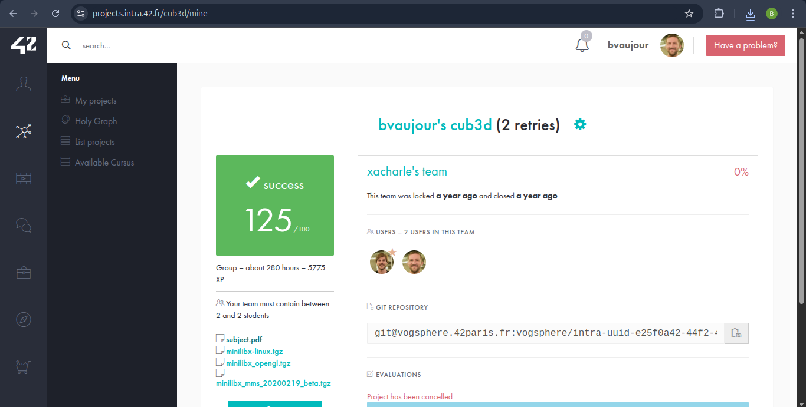

# cub3d
[Voir le sujet](./subject.pdf)

Projet de niveau 5 de l'école 42.

Création d’un moteur de rendu en pseudo 3D basé sur le raycasting, inspiré du jeu Wolfenstein 3D. Le joueur peut se déplacer dans un labyrinthe vu à la première personne, avec gestion des murs, textures et collisions.

### MiniLibX
Le projet utilise **MiniLibX**, une petite bibliothèque graphique développée par 42. Elle fournit des fonctions de base pour créer une fenêtre, afficher des pixels, gérer les images, le clavier et la souris. Elle sert à découvrir les bases du rendu graphique sans moteur externe.

### Fonctionnalités principales :
- **Raycasting :** Simulation d’un environnement 3D à partir d’une carte 2D.
- **Textures :** Affichage de textures sur les murs.
- **Déplacement libre :** Mouvements avant/arrière, gauche/droite, et rotation de la vue.
- **Gestion des collisions :** Empêche le joueur de traverser les murs.
- **Minimap (Bonus) :** Affichage en vue du dessus du niveau.

### Aperçu en vidéo :

### Utilisation:

## Dépendances MinilibX:
sudo apt-get update && sudo apt-get install xorg libxext-dev zlib1g-dev libbsd-dev

make bonus
./cub3D_bonus maps_bonus/corridor.cub
